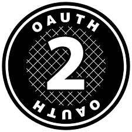

# Houden

OAuth2 client implementation written in pure Scala.
 

## External Resources

## Usage

## Introduction

## Contributing

## License

This project is licensed under the MIT License - see the [LICENSE](LICENSE) file for details

## Acknowledgments
